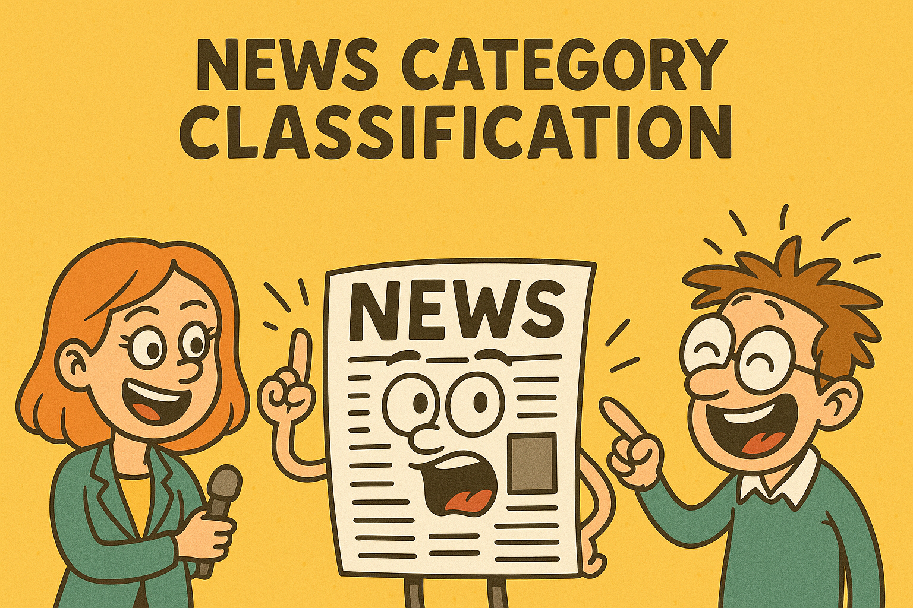

# 📰 AG News Classification Project



## 🌟 Overview
A machine learning-powered web application that automatically classifies news articles into four categories:  
🌍 **World** | 🏅 **Sports** | 💼 **Business** | 🔬 **Sci/Tech**

Built with **Python**, **Scikit-learn**, **XGBoost**, and **TensorFlow**, this project demonstrates:
- Natural Language Processing (NLP) techniques
- Comparison between classical ML and deep learning models
- Production-ready deployment workflow
- Clean and responsive UI design

---

## 🚀 Key Features

### 🔍 Core Functionality
- **Text Classification**: Predicts news categories from headlines and descriptions
- **High Accuracy**: Achieved over **91%** accuracy on test data
- **Fast Inference**: Logistic Regression processes inputs in under **0.5 seconds**

### 🎨 User Experience
- Dark mode interface for eye comfort
- Responsive layout (desktop & mobile)
- Minimal, clean input/output workflow

### ⚙️ Technical Highlights
- Custom text preprocessing pipeline
- TF-IDF vectorization for classical ML
- RNN, GRU, and LSTM architectures for deep learning comparison
- Model persistence with Joblib

---

## 📂 Project Structure
```
project/
│
├── src/
│   ├── assets/              # Pretrained model(s)
│   │   └── logistic_regression.joblib
│   ├── notebook/
│   │    └── AG_News_clf.ipynb
│   ├── config.py
│   ├── inference.py
│   ├── schemas.py
│   ├── views/
│   │    └── app.py
│
├── main.py
├── requirements.txt
└── README.md
```

---

## 🛠️ Installation

### Prerequisites
- Python 3.8+
- pip package manager

### Setup Steps
```bash
# Clone the repository
git clone https://github.com/asmaa-2ahmed/AG-News-Classification.git
cd AG-News-Classification

# Install dependencies
pip install -r requirements.txt

# Download NLTK data
python -c "import nltk; nltk.download(['stopwords', 'punkt', 'wordnet'])"
```

---

## 🏃‍♂️ Running the Application
```bash
streamlit run main.py
```
The app will open in your browser at **http://localhost:8501**.

---

## 🧠 Model Details

### 📊 Training Data
- **Dataset**: AG News Classification Dataset (120,000 training / 7,600 test samples)
- **Categories**: World, Sports, Business, Sci/Tech
- **Balanced classes**

### 🏆 Performance Metrics
| Model               | Accuracy  | F1-score  | Train Time  | Inference Time |
|---------------------|-----------|-----------|-------------|----------------|
| Logistic Regression | **91.56%**| **0.9154**| 13.8s       | **0.48s**      |
| XGBoost             | 91.03%    | 0.9100    | 542.2s      | 1.02s          |
| RNN                 | 91.49%    | 0.9148    | 1560.8s     | 13.66s         |
| GRU                 | 91.79%    | 0.9178    | 4485.8s     | 41.07s         |
| LSTM                | 91.68%    | 0.9167    | 3375.2s     | 81.98s         |

**Final Choice:** Logistic Regression — best trade-off between performance, speed, and deployment cost.

---

## 🧹 Preprocessing Pipeline
- Remove HTML tags
- Clean special characters
- Lowercasing
- Tokenization
- Lemmatization
- Stopword removal

---

## 🌐 Live Demo
*(Optional — replace this with your deployment URL)*  
[](YOUR_DEPLOYMENT_URL)

---

## 🤝 Contributing
1. Fork the repo  
2. Create your feature branch:  
   ```bash
   git checkout -b feature/AmazingFeature
   ```
3. Commit your changes:  
   ```bash
   git commit -m "Add some amazing feature"
   ```
4. Push to the branch:  
   ```bash
   git push origin feature/AmazingFeature
   ```
5. Open a Pull Request

---

## 📜 License
Distributed under the MIT License. See `LICENSE` for details.

---

## 📧 Contact
Asmaa Ahmed  
📩 Email: your.email@example.com  
🔗 GitHub: [AG News Classification](https://github.com/asmaa-2ahmed/AG-News-Classification)

---

## 📎 Appendix: Sample Classifications
| Category  | Example Headline |
|-----------|------------------|
| World     | "UN Announces Global Climate Agreement" |
| Sports    | "Argentina Wins World Cup in Penalty Shootout" |
| Business  | "Tesla Stock Surges After Earnings Report" |
| Sci/Tech  | "NASA Discovers Earth-Like Exoplanet" |
